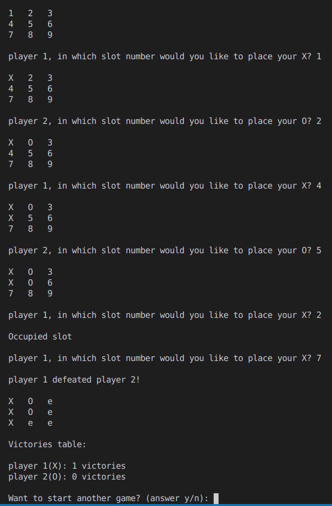

# Tic-tac-toe game

**tic-tac-toe** is a simple text-based game written in **C**.
It was created as a practice project for working with multiple source files, manipulating bits, and using structures in C.

## How the Game Works
- The game board is displayed as a 3×3 table, where each square is represented by a number.  
- Two players take turns placing **X** or **O** until the game ends.  
- Multiple rounds can be played. When the players choose to stop, the program announces the overall winner based on the number of victories.

## Project Structure
- **`game.h`** – Header file with function declarations and structures.  
- **`game.c`** – Function implementations.  
- **`main.c`** – Entry point of the program.  
- **`.vscode/tasks.json`** and **`.vscode/launch.json`** – Configuration files for automatic compilation, running, and debugging in **Visual Studio Code**.

## Purpose
This project is primarily educational, focusing on:
- Practicing modular programming with multiple files in C.  
- Understanding bit-level board representation (only in the first version).
- Using structures and functions effectively.

## Installation

### Quick Launch
For most users, the fastest way to run the game is to use the precompiled executables:
- **Windows**: download `windows_tic-tac-toe.exe` and double-click to start the game.  
- **Linux**: download `linux_tic-tac-toe`, open a terminal in the download folder, and run:  
  ```bash
  ./linux_tic-tac-toe

### Manual Compilatio
If the quick launch executables do not work on your system, you can compile the program yourself:
1. Download the entire project folder.
2. Open a terminal in the project directory.
3. Compile the source code with:
    gcc main.c utils.c -o tic-tac-toe
4. Run the program with:
    ./tic-tac-toe

### Running from VS Code
The repository also includes VS Code configuration files for easy building and debugging:
1. Open the project in Visual Studio Code.
2. Use the Run or Debug options to build and start the game automatically.

## Game board example


---

*This README was generated with the help of an AI assistance.*
